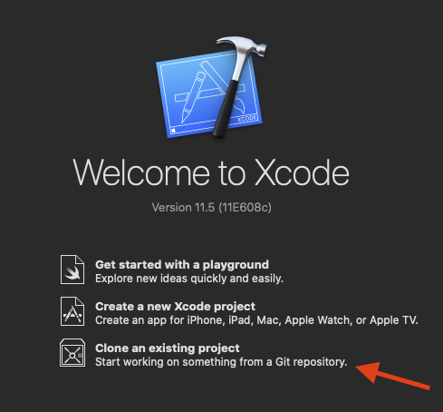

# GithubFollowers
 - The user can enter a GitHub username and retrieve a list of that username's followers. 
 - The user can search within these followers for a specific follower.
 - The user is able to tap on a follower from that list to get more information about that follower. 
 - The user is able to save favourite username searches so they don't have to type them every time. (Everything is stored locally)

# GithubFollowers app
 

With this iOS app it's possible to check someone's github followers and view their profiles.
You can also save GitHub profiles locally in the "favourites" tab and remove them with gestures.

  

# Technologies used
This app has been made from scratch (no 3rd party libraries used) with Swift5, XCode, programmaticUI, the GitHub API and the Model-View-Controller (MVC) architecture.

# Requirements
 - MacOS catalina
 - XCode 11
 - Swift 5
 - an iPhone with iOS 13.0 +
 
 
# How to clone
1) Open xcode

2) Click on "Clone an existing project"

3) Paste the link on the search bar, and click clone.

